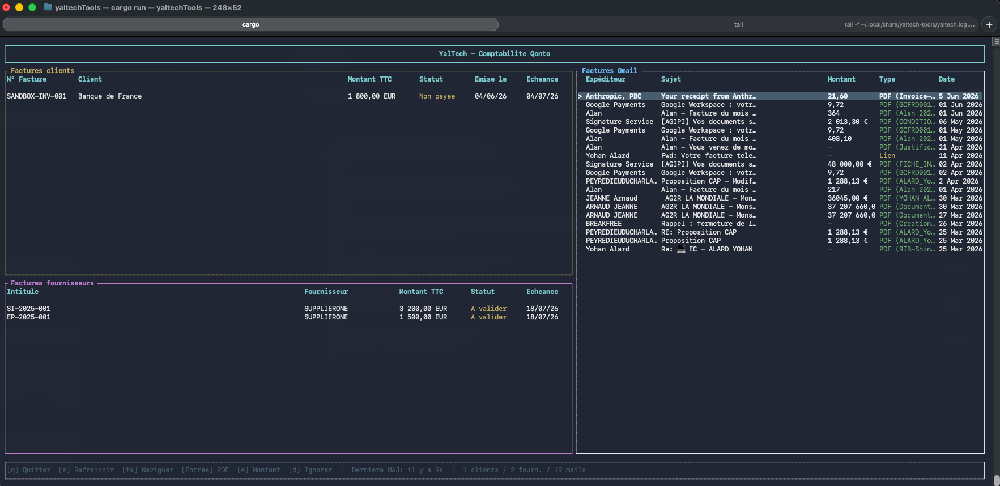

# YalTech Tools

Tableau de bord comptable en terminal (TUI) qui consolide en une seule vue les factures **Qonto** (clients et fournisseurs) et les factures reçues par **Gmail**.



## Fonctionnalités

### Vue consolidée
- **Factures clients Qonto** — numéro, client, montant TTC, statut (payée / non payée / brouillon / annulée), dates d'émission et d'échéance
- **Factures fournisseurs Qonto** — numéro, fournisseur, montant TTC, statut (à valider / approuvée / payée…), date d'échéance
- **Factures Gmail** — détection automatique dans les mails récents : extraction du montant depuis les PDFs joints, sinon détection d'un lien de téléchargement

### Authentification OAuth2
- Flow OAuth2 complet pour **Qonto** (sandbox ou production) et **Gmail**
- Tokens stockés localement et rafraîchis automatiquement

### Extraction PDF
- Téléchargement et mise en cache des pièces jointes PDF
- Extraction automatique du montant TTC par expression régulière
- Ouverture du PDF dans l'application par défaut avec `Entrée`

### Cache SQLite
- Les métadonnées des mails et montants extraits sont mis en cache dans SQLite
- Évite de re-télécharger à chaque lancement ; seuls les nouveaux mails sont traités

### Raccourcis clavier (panel Gmail)
| Touche | Action |
|--------|--------|
| `↑` / `↓` | Naviguer dans la liste |
| `Entrée` | Ouvrir le PDF joint |
| `e` | Saisir / corriger le montant manuellement |
| `d` | Ignorer la facture (archivage du PDF) |
| `r` | Rafraîchir toutes les données |
| `q` | Quitter |

### Autres
- Auto-refresh configurable (défaut : 5 minutes)
- Logs dans `~/.local/share/yaltech-tools/yaltech.log`

---

## Prérequis

- Rust (edition 2024 / rustc ≥ 1.85)
- Un compte **Qonto** avec une application OAuth configurée (sandbox ou production)
- Un projet **Google Cloud** avec l'API Gmail activée et des credentials OAuth2

## Installation

```bash
git clone https://github.com/yohan-alard/yaltechTools.git
cd yaltechTools
cargo build --release
```

## Configuration

### `.env`

```env
qonto.client_id=<votre_client_id>
qonto.client_secret=<votre_client_secret>
qonto.header_staging=<staging_token>   # sandbox uniquement

google.client_id=<votre_client_id>
google.client_secret=<votre_client_secret>
```

### `config.toml`

```toml
[qonto]
oauth_base    = "https://oauth-sandbox.staging.qonto.co"
api_base      = "https://thirdparty-sandbox.staging.qonto.co"
redirect_uri  = "http://localhost:8080"
redirect_port = 8080
scope         = "offline_access client_invoices.read supplier_invoice.read"

[google]
auth_base     = "https://accounts.google.com/o/oauth2/v2/auth"
token_url     = "https://oauth2.googleapis.com/token"
api_base      = "https://gmail.googleapis.com/gmail/v1"
redirect_uri  = "http://localhost:8081"
redirect_port = 8081
scope         = "https://www.googleapis.com/auth/gmail.readonly"
mail_query    = "subject:facture OR (has:attachment filename:pdf) newer_than:90d"
max_results   = 50

[app]
token_store        = "~/.local/share/yaltech-tools/qonto_tokens.json"
google_token_store = "~/.local/share/yaltech-tools/google_tokens.json"
cache_db           = "~/.local/share/yaltech-tools/cache.db"
pdf_dir            = "~/.local/share/yaltech-tools/pdfs"
auto_refresh_secs  = 300
```

## Lancement

```bash
cargo run --release
```

Au premier lancement, un navigateur s'ouvre pour chaque service (Qonto puis Gmail). Après autorisation, les tokens sont sauvegardés localement et le TUI démarre.
